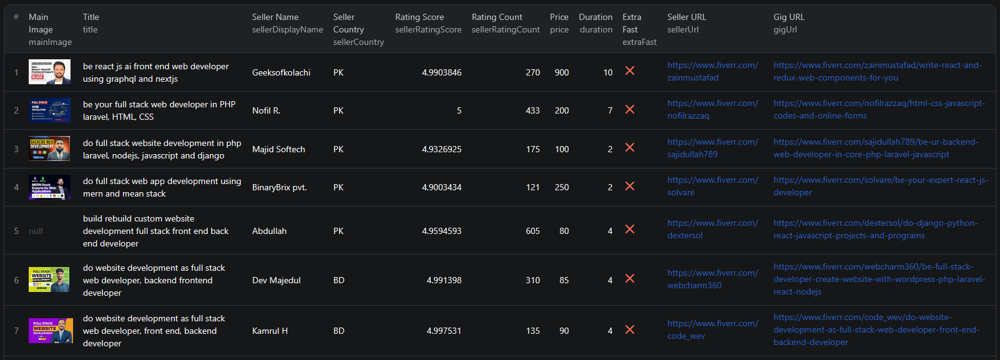

# How to Scrape Fiverr in Node.js

This repo shows how to use an [Apify actor](https://apify.com) to extract Fiverr listing data in Node.js — without building a scraper from scratch.



It's a simple, ready-to-run usage example that calls the existing **Fiverr Listings Scraper** actor on Apify, passes it a search URL, and prints the results.

---

## What This Example Does

- Calls the Apify `piotrv1001/fiverr-listings-scraper` actor
- Passes a Fiverr search URL as input
- Waits for the run to finish
- Fetches dataset items from the completed run
- Prints the results to the console

---

## Prerequisites

- [Node.js](https://nodejs.org/) v18 or higher
- An [Apify account](https://console.apify.com/sign-up)
- An Apify API token (found in **Apify Console → Settings → Integrations**)

---

## Installation

```bash
npm install
```

---

## Environment Setup

Copy the example env file and add your Apify token:

```bash
cp .env.example .env
```

Then open `.env` and replace `your_apify_token_here` with your actual token:

```env
APIFY_TOKEN=your_actual_token_here
```

---

## Usage

```bash
npm start
```

---

## Code Example

```js
import { ApifyClient } from 'apify-client';
import 'dotenv/config';

// Initialize the ApifyClient with your Apify API token
// Set APIFY_TOKEN in your .env file (copy .env.example to get started)
const client = new ApifyClient({
    token: process.env.APIFY_TOKEN,
});

// Prepare Actor input
const input = {
    "searchUrls": [
        "https://www.fiverr.com/search/gigs?query=front%20end%20web%20developer"
    ],
    "maxItemsPerUrl": 100
};

// Run the Actor and wait for it to finish
const run = await client.actor("piotrv1001/fiverr-listings-scraper").call(input);

// Fetch and print Actor results from the run's dataset (if any)
console.log('Results from dataset');
console.log(`💾 Check your data here: https://console.apify.com/storage/datasets/${run.defaultDatasetId}`);
const { items } = await client.dataset(run.defaultDatasetId).listItems();
items.forEach((item) => {
    console.dir(item);
});

// 📚 Want to learn more 📖? Go to → https://docs.apify.com/api/client/js/docs
```

---

## Example Output

See [`sample-output.json`](./sample-output.json) for an example of what the scraped data looks like.

Each item includes:
- Gig title, ID, and URL
- Seller name, country, level, rating, and review count
- Price and delivery duration
- Gig thumbnail image
- Metadata (website type, programming languages, features)

---

## Use Cases

- **Lead generation** — find freelancers offering specific services
- **Competitor research** — analyze what gigs rank for your target keywords
- **Freelancer marketplace analysis** — understand supply, demand, and pricing trends
- **Service pricing research** — benchmark rates across different skill levels and regions

---

## Try the Fiverr Scraper on Apify

**[Open the Fiverr Listings Scraper on Apify](https://apify.com/piotrv1001/fiverr-listings-scraper)**

No code required — you can also run it directly from the Apify platform.

---

## Related Resources

- [Blog post: How to Scrape Fiverr in Node.js](https://www.falconscrape.com/blog/how-to-scrape-fiverr-sellers-and-gigs)
- [YouTube tutorial: Fiverr Scraper with Node.js](https://youtu.be/stX22xQlZYU)

---

## License

MIT
